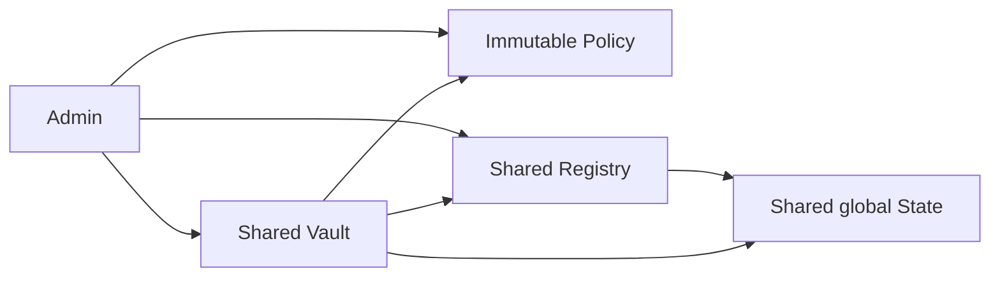
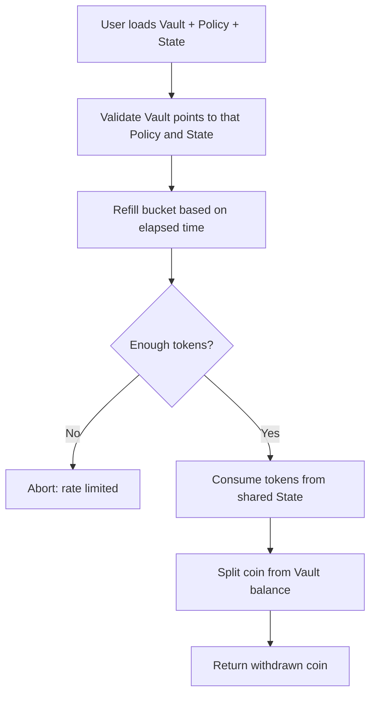
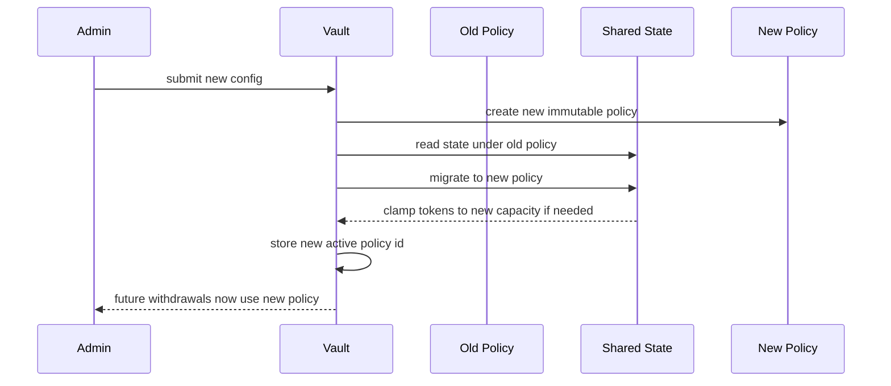
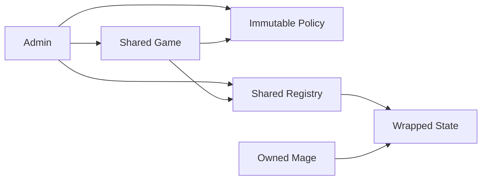
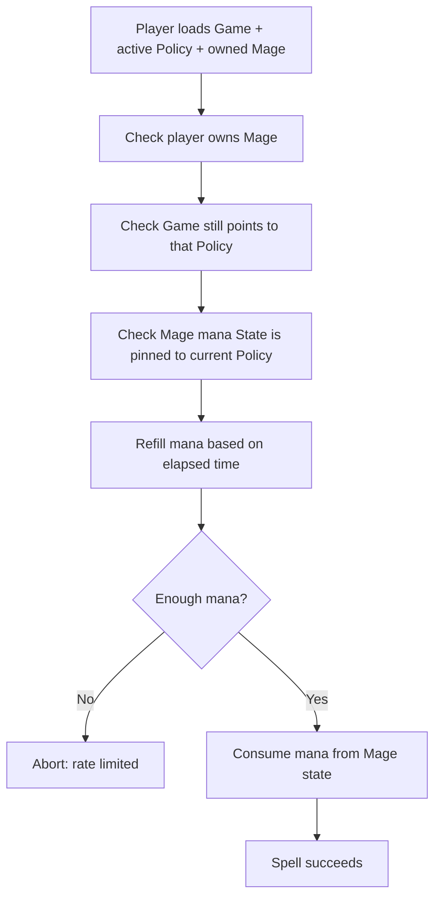
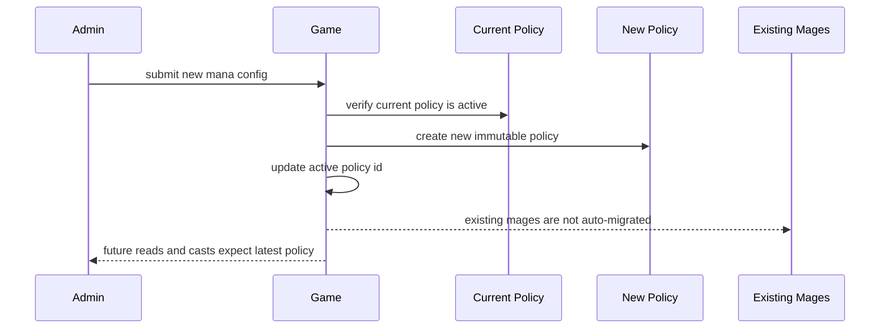
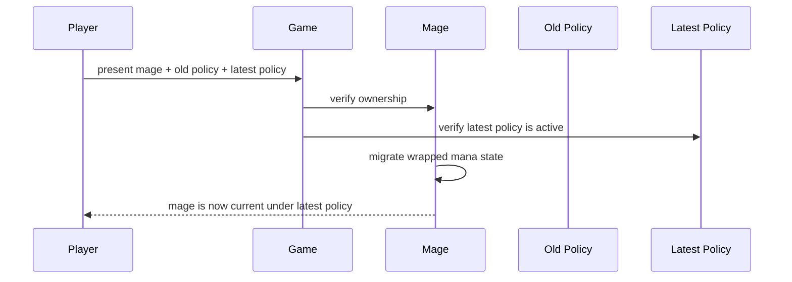

# Rate Limiter Design Proposal

A simple, reusable onchain rate-limiter pattern for Sui.

This is what is used in [Deepbook's reference implementation](https://github.com/MystenLabs/deepbookv3/blob/fc77fb207169be2e79ca9c24aae4ae46431fad1b/packages/deepbook_margin/sources/rate_limiter.move).

This package shows how to separate **configuration**, **state claiming**, and **live usage** so products can enforce limits cleanly, upgrade safely, and explain behavior clearly. It includes two concrete examples:

- **Vault**
  - one shared rate limit for all withdrawals

- **Mage Game**
  - one active mana policy for the game, with a separate mana state for each mage

# The Design in Plain English

The design is built around three objects:

- **`Policy<Tag>`**
  - the immutable rate-limiter rules
  - capacity, refill amount, refill interval, and version

- **`Registry<Tag>`**
  - the object used to claim canonical limiter states exactly once
  - this prevents duplicate state creation for the same scope

- **`State<Tag>`**
  - the live mutable accounting
  - stores which policy it is pinned to and how many tokens are currently available

## Why this split is useful

- **Explicit upgrades**
  - policy changes happen by creating a new `Policy`, not by mutating one in place

- **Small hot path**
  - normal usage updates only the `State`, which keeps the main enforcement path simple

- **Canonical state per scope**
  - the `Registry` ensures each scope gets one deterministic limiter state

- **Observable migrations**
  - when a policy changes, state migration is explicit and easy to audit

- **Flexible rollout options**
  - some products can migrate immediately, while others can migrate gradually

- **Reusable architecture**
  - the same pattern supports global limits, per-user limits, and per-object limits

# Example 1: Vault

The `Vault` example models a shared pool where everyone can deposit, but **all withdrawals consume from one shared global token bucket**.

This is useful when the product needs to control **total outflow**, not individual user behavior.

## Why this implementation is valuable

- **Protects aggregate liquidity**
  - the whole vault can only drain at the configured pace

- **Easy to reason about**
  - one vault, one shared limiter state, one active policy

- **Fast operational updates**
  - when policy changes, the vault can migrate its single shared state immediately

## Vault Architecture at Creation

## Vault Flow: Withdraw

## Vault Flow: Update Rate Limiter Configuration

# Example 2: Mage Game

The `Mage Game` example models a game where the **game has one active mana policy**, but **each mage owns its own mana state**.

This is useful when the product wants a shared ruleset, but independent player or object usage.

## Why this implementation is valuable

- **Per-player fairness**
  - one mage spending mana does not affect another mage

- **Better scalability**
  - players do not compete on one shared limiter state for normal gameplay

- **Safer live balancing**
  - the game can switch to a new policy while letting players migrate explicitly

## Mage Game Architecture at Creation

## Mage Game Flow: Cast Spell

## Mage Game Flow: Update Rate Limiter Configuration

## Mage Game Flow: Player Policy Migration

# Key Difference Between the Two Examples

| Topic | Vault | Mage Game |
| --- | --- | --- |
| **Scope of limiting** | One shared global limit | One independent limit per mage |
| **Who shares the state** | All users share one state | Each mage has its own state |
| **Policy update behavior** | Shared state is migrated immediately | Game updates policy first, each mage migrates later |
| **Best for** | Aggregate outflow control | Independent player or object usage |

# Takeaway

This pattern gives a product team a clean way to enforce rate limits **without tying everything to one mutable object or one fragile upgrade path**.

It is useful because it combines:

- **clear rules**
  - immutable policies

- **safe state ownership**
  - canonical claimed states

- **controlled upgrades**
  - explicit migration when policies change

That makes it a strong fit for products that need rate limiting to be **auditable, upgradeable, and easy to reason about in production**.

# Possible Use Cases for the Token Bucket

- Protocol-wide withdrawal throttling
- Per-user claim or redemption limits
- Rate-limited borrowing or minting
- Mana, stamina, or action energy in games
- Dungeon, raid, or reward-entry throttling
