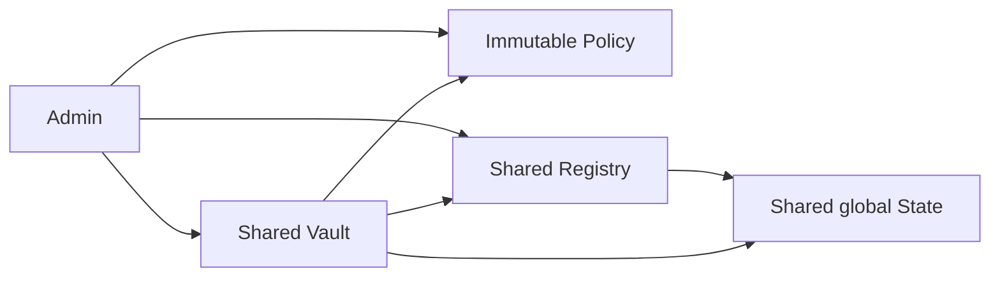
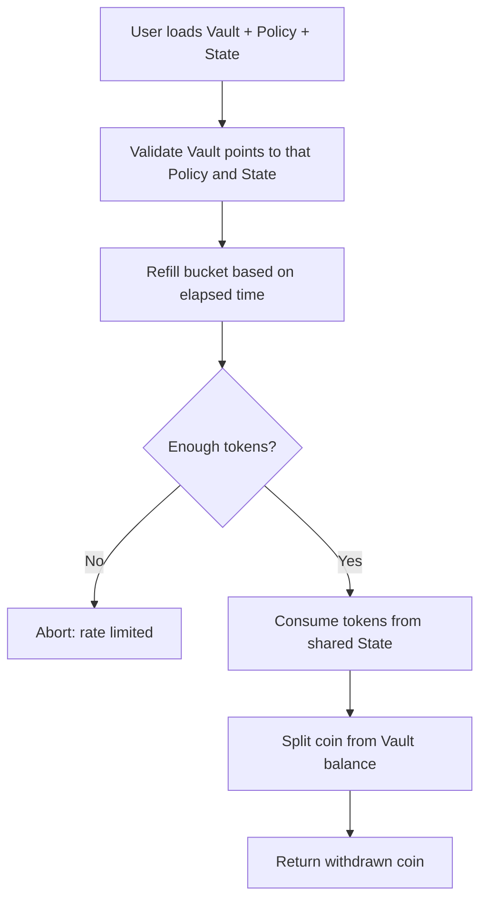
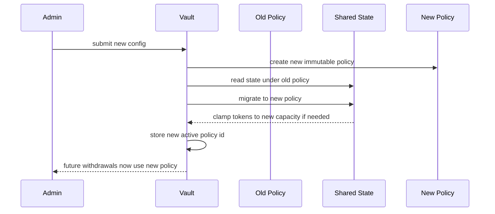
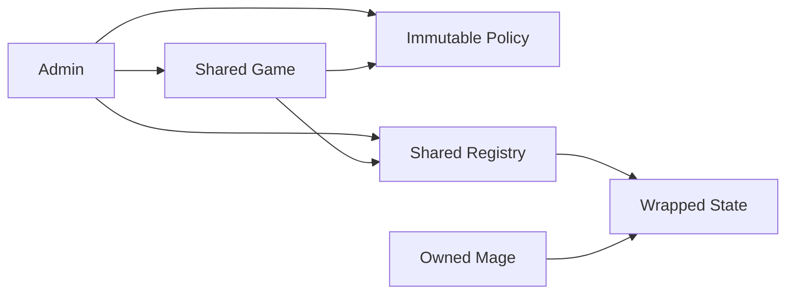
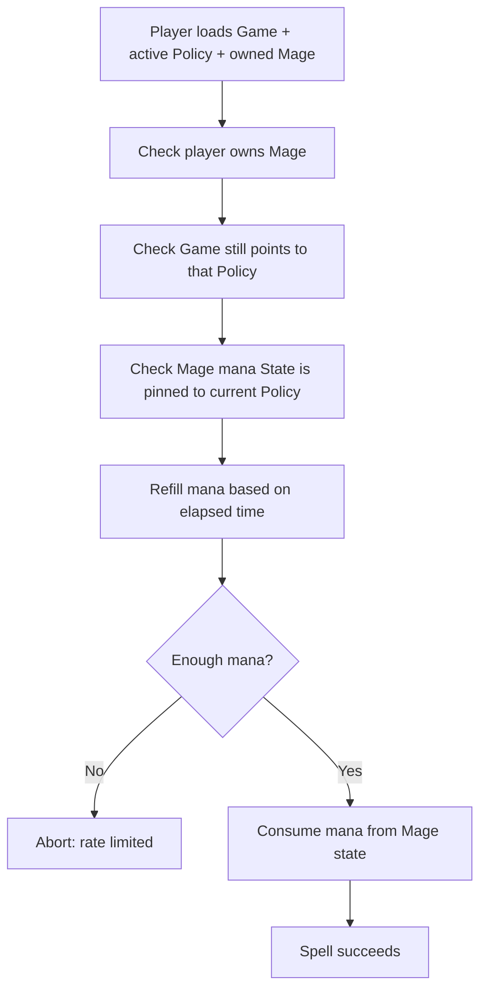
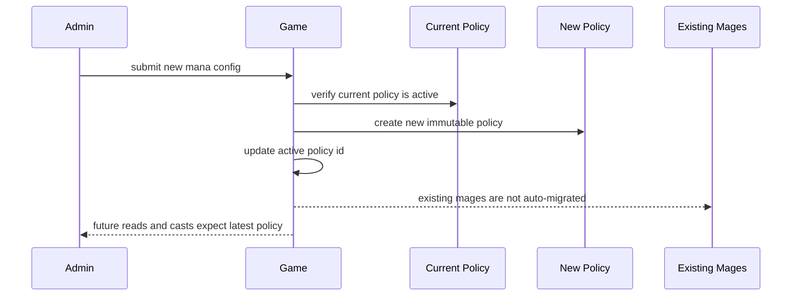
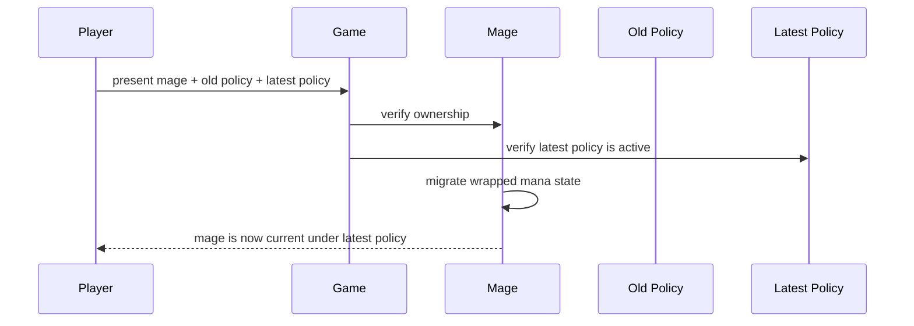

# Rate Limiter Design Proposal

A simple, reusable onchain rate-limiter architecture for Sui.

This repo uses a **token bucket** limiter to demonstrate the design, but the more important idea is
the overall split between:

- immutable rules,
- canonical state creation,
- live mutable accounting,
- explicit migration when rules change.

That same split can also be used for **cooldown** and **fixed window** limiters, not just token
bucket.

> NOTE: the "token bucket" limiter is what is used in the [Deepbook's reference implementation][reference].

This proposal includes two concrete examples:

- **Vault**
  - one shared rate limit for all withdrawals

- **Mage Game**
  - one active mana policy for the game, with a separate mana state for each mage
  
# What This Repo Is Trying to Show

The goal of this repo is not only to show a token bucket implementation. The main goal is to show a
**clear rate-limiter architecture** that a protocol can explain, audit, and evolve.

The design tries to answer these questions cleanly:

- **What are the current rules?**
  - that is `Policy<Tag>`

- **How do we ensure each scope gets one canonical limiter state?**
  - that is `Registry<Tag>`

- **What object changes on normal usage?**
  - that is `State<Tag>`

- **How do rule changes happen without silently mutating live state?**
  - create a new policy and explicitly migrate state

# The Three Scopes

To understand the design, it helps to separate three scopes.

## 1. Library Scope

This is `library_scope::token_bucket`.

The library provides generic building blocks:

- `Policy<Tag>`
- `Registry<Tag>`
- `State<Tag>`
- claim functions
- read / consume functions
- migration function

At this scope, the library is intentionally generic. It does **not** decide which policy a specific
protocol considers active, or which users are allowed to rotate policy.

## 2. Integrator Scope

This is the protocol that uses the library, such as `vault` or `mage_game`.

The integrator decides:

- who may create or rotate policy,
- which policy is currently active,
- which state object is the valid one for that product flow,
- when migration is allowed,
- what end users are allowed to call directly.

This is why the examples store active ids and validate them on every meaningful read or write path.

## 3. End-User Scope

This is the user of the protocol.

The end user should not be thought of as managing generic library objects directly. Instead, the end
user interacts through protocol-defined entry points such as:

- `vault::withdraw`
- `vault::remaining_capacity`
- `mage_game::cast_*`
- `mage_game::update_mage_policy`

That is the intended flow the examples are presenting.

# The Design (in Plain English)

The design is built around three objects.

## `Policy<Tag>`

This is the **rule object**.

It answers:

- how much capacity exists,
- how refill works,
- which version of the rules we are talking about.

It is kept separate from `State<Tag>` so the rules can stay immutable and easy to audit, while live
usage updates only the mutable state.

Important point: creating a policy object by itself does **not** make it authoritative for a
protocol. A protocol still has to decide which policy it recognizes as active.

## `Registry<Tag>`

This is the **canonical claim anchor**.

Its purpose is to make state creation unique per scope, by relying on [sui::derived_object][derived_object]. For example:

- one global scope should have one global state,
- one address scope should have one state for that address,
- one object scope should have one state for that object.

Without the registry, the protocol would need some separate mutable mapping just to answer:

> Has this scope already received its limiter state?

The registry makes that creation story explicit and deterministic.

[derived_object]: https://docs.sui.io/references/framework/sui_sui/derived_object

## `State<Tag>`

This is the **live mutable accounting object**.

It answers:

- which policy it is currently pinned to,
- how many units are currently available,
- when it last refilled,
- which scope it belongs to.

This is the object that changes on the hot path, the one actually doing the "rate limiting".

# Why These Types Are Separate

- **`Policy` is separate from `State`**
  - because rules should be stable and easy to audit, while usage changes frequently

- **`Registry` is separate from `State`**
  - because uniqueness of state creation is a different concern from runtime accounting

- **`State` is separate from the integrator object**
  - because some products want one shared state, while others want one state per user or per object

This split makes the architecture reusable across many products instead of tying it to one single
storage pattern.

# What the Library Enforces

The library itself enforces these things:

- **Canonical state claiming through the registry**
  - the intended state-creation path goes through `Registry<Tag>`

- **Policy-pinned state accounting**
  - reads and consumption check that a state is pinned to the supplied policy

- **Explicit migration mechanics**
  - a state does not silently become attached to a new policy; migration is an explicit call

- **Small hot path**
  - normal usage mainly touches `State<Tag>`

# What the Integrator Must Enforce

The library is generic on purpose, so the integrator still has important responsibilities.

The integrator should decide and enforce:

- **Which policy is currently active**
  - for example, both `vault` and `mage_game` store an active policy id

- **Which state is valid for the product flow**
  - for example, `vault` stores the canonical shared state id

- **Who may rotate policy**
  - for example, the examples use admin address checks

- **When migration is allowed**
  - immediate in the vault, staged in the mage game

- **How end users are expected to interact**
  - through protocol entry points, not by inventing their own policy lifecycle

# Current Design vs Possible Hardening Ideas

This repo is showing the architecture and the flows clearly first. It is **not** claiming that every
possible hardening idea is already implemented.

Possible future hardening directions include:

- **Supporting both immutable and mutable policy strategies**
  - one option would be an immutable flow such as `create_policy_and_freeze`, where a new policy is
    created and old policies continue to exist, making explicit user or object migration the natural
    upgrade path
  - another option would be a mutable flow built around `create_policy` plus an in-place update API,
    where one policy remains authoritative and a policy update applies to all users immediately
  - this may be more complexity than the library needs, so it should be weighed carefully against
    the simpler immutable-only model
  - the immutable strategy remains especially attractive for tracking and auditing, because policy
    changes stay explicit and historical policy objects still exist

- **Admin capability for policy creation**
  - instead of relying only on integrator-level admin gating

- **Tighter wrapping of policy/state objects**
  - to reduce how visible or transferable helper objects are to users

- **More opinionated library APIs**
  - if the goal shifts from showcasing the architecture to shipping a stricter production library

Those are useful design discussions, but they should be understood as **future options**, not as the
current behavior of this repo.

# Example 1: Vault

The `Vault` example models a shared pool where everyone can deposit, but **all withdrawals consume
from one shared global token bucket**.

This is useful when the product needs to control **total outflow**, not individual user behavior.

## Vault Flow in Plain English

- **Setup**
  - the admin creates the vault, one policy, one registry, and one shared global state

- **Normal user behavior**
  - users deposit freely
  - every withdrawal consumes from the same shared state

- **What the user experiences**
  - if one user withdraws first, less shared capacity remains for the next user

- **Policy updates**
  - the admin creates a new policy and immediately migrates the one shared state

## Why this implementation is valuable

- **Protects aggregate liquidity**
  - the whole vault can only drain at the configured pace

- **Easy to reason about**
  - one vault, one shared limiter state, one active policy

- **Fast operational updates**
  - when policy changes, the vault can migrate its single shared state immediately

## Vault Architecture at Creation

## Vault Flow: Withdraw

## Vault Flow: Update Rate Limiter Configuration

# Example 2: Mage Game

The `Mage Game` example models a game where the **game has one active mana policy**, but **each mage
owns its own mana state**.

This is useful when the product wants a shared ruleset, but independent player or object usage.

## Mage Game Flow in Plain English

- **Setup**
  - the admin creates the game, one registry, and the first mana policy

- **Onboarding**
  - each new mage claims its own canonical mana state from the shared registry

- **Normal user behavior**
  - each mage spends from its own state, so one mage does not drain another mage's mana

- **Policy updates**
  - the game switches to a new active policy first
  - existing mages must explicitly migrate before they can keep casting

## Why this implementation is valuable

- **Per-player fairness**
  - one mage spending mana does not affect another mage

- **Better scalability**
  - players do not compete on one shared limiter state for normal gameplay

- **Safer live balancing**
  - the game can switch to a new policy while letting players migrate explicitly

## Mage Game Architecture at Creation

## Mage Game Flow: Cast Spell

## Mage Game Flow: Update Rate Limiter Configuration

## Mage Game Flow: Player Policy Migration

# Key Difference Between the Two Examples

| Topic | Vault | Mage Game |
| --- | --- | --- |
| **Scope of limiting** | One shared global limit | One independent limit per mage |
| **Who shares the state** | All users share one state | Each mage has its own state |
| **Policy update behavior** | Shared state is migrated immediately | Game updates policy first, each mage migrates later |
| **Best for** | Aggregate outflow control | Independent player or object usage |

# Why Token Bucket Is Used Here

Token bucket is used here because it was used in [Deepbook][reference], it is easy to explain and has a rich enough lifecycle to showcase:

- setup,
- normal usage,
- refill over time,
- policy rotation,
- explicit migration.

But the main proposal is bigger than token bucket. The same architecture can also support other rate
limiter families such as **cooldown** and **fixed window**.

# Use Cases

## Token Bucket

Best when you want smooth refill over time and a limited burst capacity.

Possible use cases:

- **Protocol-wide withdrawal throttling**
  - allow some burst outflow, but refill capacity gradually to protect liquidity

- **Per-user claim or redemption limits**
  - let users claim or redeem at a sustainable pace without banning short bursts entirely

- **Rate-limited borrowing or minting**
  - prevent sudden spikes while still allowing some responsive usage

- **Mana, stamina, or action energy in games**
  - support natural refill over time with a visible max capacity

- **RWA redemption pacing**
  - smooth cash-out pressure for tokenized real-world assets while keeping some immediate liquidity

## Cooldown

Best when you want a required wait period between actions.

Possible use cases:

- **Vault or bridge emergency withdrawals**
  - after one withdrawal, require a delay before the same user or object can act again

- **High-impact admin or governance operations**
  - force a wait period between sensitive actions so monitoring and intervention are possible

- **Game abilities with fixed recovery time**
  - each skill use starts a cooldown before it can be used again

- **RWA settlement or redemption requests**
  - require a minimum wait between redemption events for the same account or position

- **Claim abuse reduction**
  - stop rapid repeated farming actions even when each individual action is small

## Fixed Window

Best when you want simple limits per discrete period, such as per hour or per day.

Possible use cases:

- **Daily withdrawal caps**
  - cap how much can leave a protocol per day or per user per day

- **Daily mint or borrow quotas**
  - easy-to-explain production limits for compliance or risk management

- **Event entry or reward claims per epoch**
  - let players enter or claim a fixed number of times in each event window

- **RWA issuance quotas**
  - enforce how much of an asset can be issued or redeemed during a reporting period

- **Campaign or incentive controls**
  - keep emissions or promotional usage within fixed operational budgets

# Takeaway

This design gives a product team a clear way to separate:

- **rules**
  - immutable policy

- **uniqueness of state creation**
  - registry-based claiming

- **live usage**
  - mutable state

- **upgrades**
  - explicit migration to new policy

That makes the design easier to explain, easier to audit, and easier to evolve than a single mutable
rate-limiter object that tries to do everything at once.

[reference]: https://github.com/MystenLabs/deepbookv3/blob/fc77fb207169be2e79ca9c24aae4ae46431fad1b/packages/deepbook_margin/sources/rate_limiter.move
