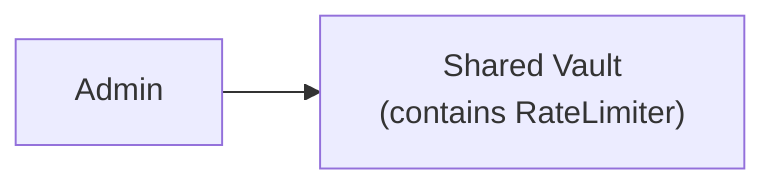
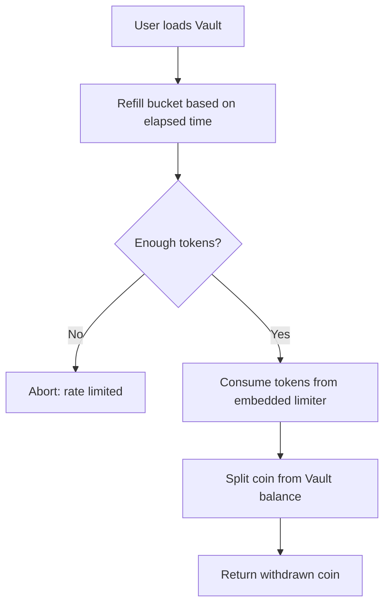
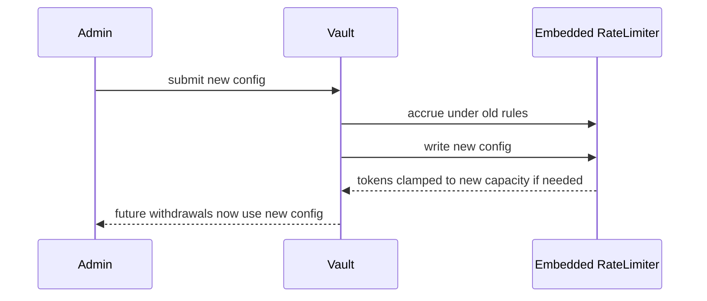
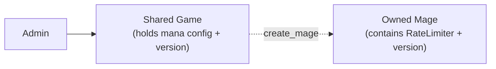
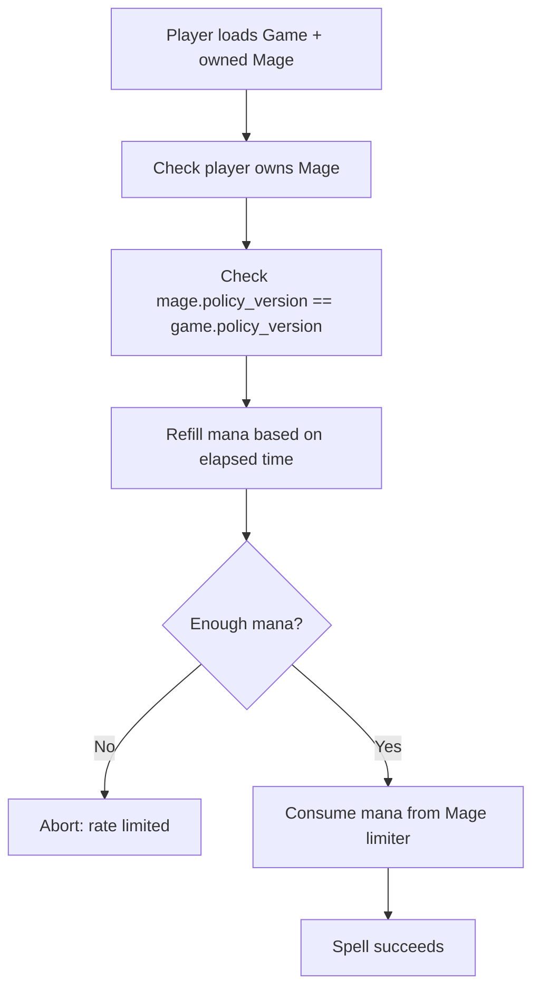
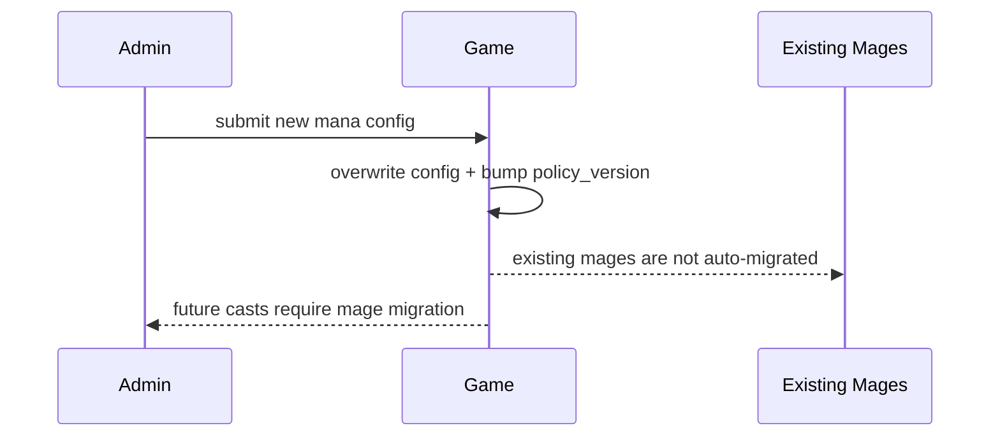
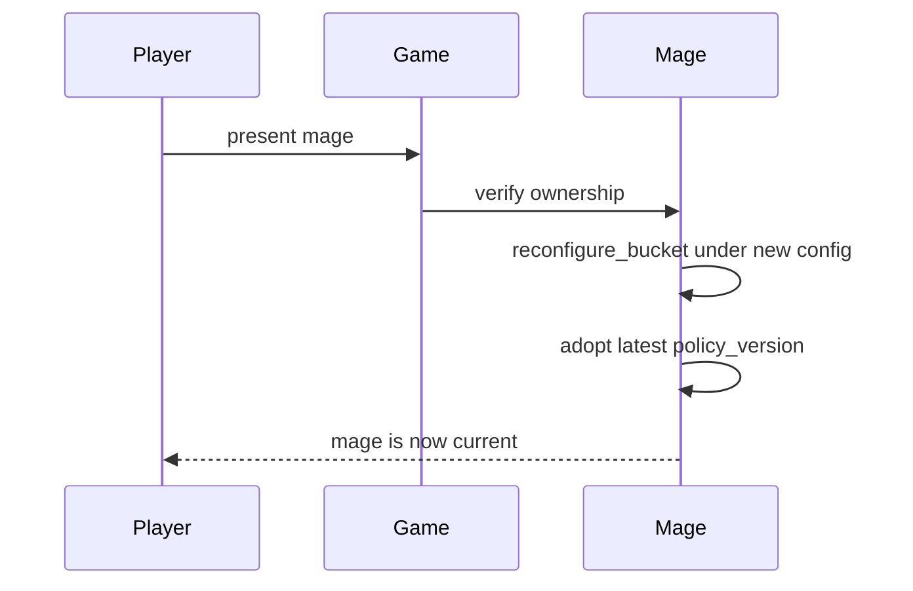

# Rate Limiter Design Proposal

A small, embeddable onchain rate-limiting primitive for Sui, modelled after `sui::balance`.

`RateLimiter` is a plain `store + drop` value that integrators place as a field inside their
own objects. There is no registry, no standalone policy object, and no separate ID that
integrators must track and assert against. The limiter's scope is whatever object it lives
inside.

Three strategies are offered in one enum, all sharing the same API:

- **Bucket** — continuously refilling token bucket,
- **FixedWindow** — up to `capacity` units per aligned time window,
- **Cooldown** — minimum elapsed time between single-unit consumes.

> NOTE: the Bucket strategy is what is used in [Deepbook's reference implementation][reference].

This proposal includes two concrete integration examples:

- **Vault** — one shared withdrawal limit embedded in a shared vault object,
- **Mage Game** — one game-level mana configuration, with each mage owning its own limiter.

# What This Repo Is Trying to Show

The goal of this repo is to show a **minimal, embeddable rate-limiter primitive** that
integrators can drop into their own objects without inheriting any library-owned objects,
indices, or registries.

The design answers these questions:

- **How is the limiter stored?**
  - as a field inside the integrator's own object
- **How is scope uniqueness enforced?**
  - by the integrator's object model itself, not by a library-side registry
- **How do rules change?**
  - by calling `reconfigure_*` on the embedded limiter; the integrator decides who can call

# The Two Scopes

## 1. Library Scope

This is [`library_scope::rate_limiter`](library_scope/sources/rate_limiter.move).

It provides:

- `RateLimiter` (enum with `Bucket` / `FixedWindow` / `Cooldown` variants)
- `new_bucket`, `new_fixed_window`, `new_cooldown` constructors
- `consume_or_abort`, `try_consume`, `available` hot-path functions
- `reconfigure_bucket`, `reconfigure_fixed_window`, `reconfigure_cooldown` for in-place
  configuration updates

The library does not create any objects, does not own any state, and does not impose any
specific admin model. It is deliberately "standard-library-ish".

## 2. Integrator Scope

This is the protocol that embeds the limiter, such as
[`integrator_scope::vault`](integrator_scope/sources/vault.move) or
[`integrator_scope::mage_game`](integrator_scope/sources/mage_game.move).

The integrator decides:

- which of its own objects carries a limiter field,
- who can create or reconfigure the limiter,
- how migration or versioning works across configuration changes,
- what end users are allowed to call directly.

# The Design (in Plain English)

## `RateLimiter`

This is the one type the library exposes. It has `store + drop` and no `key`, so it cannot
be shared on its own — it only lives inside some integrator object.

Its variant is chosen at construction:

- `Bucket { capacity, refill_amount, refill_interval_ms, last_refill_ms, tokens }`
- `FixedWindow { capacity, window_ms, window_start_ms, used }`
- `Cooldown { cooldown_ms, last_used_ms }`

All three variants share the same entry points: `consume_or_abort`, `try_consume`,
`available`. Each variant has a matching `reconfigure_*` that rewrites its configuration
in place while preserving as much of the current accounting as makes sense (for `Bucket`,
any tokens earned under the old rules are credited before clamping to the new capacity).

# What the Library Enforces

- **Monotonic accrual**
  - bucket accrual applies only when time advances
- **Capacity clamping on reconfigure**
  - stored tokens / used counts are clamped to the new capacity
- **Variant guards on reconfigure**
  - `reconfigure_bucket` aborts if the current variant is not `Bucket`, and similarly for
    the other two

# What the Integrator Must Enforce

Because the limiter is just a field on the integrator's object, the integrator decides:

- **Who may create the object that carries the limiter**
  - for example, both `vault::create_and_share` and `mage_game::create_and_share` can be
    called by anyone, but each produces one shared object whose admin is the caller
- **Who may reconfigure the limiter**
  - both examples gate this behind an `admin` check
- **How configuration changes propagate**
  - the vault reconfigures its embedded limiter immediately
  - the mage game bumps a `policy_version` and requires each mage to migrate explicitly

# Example 1: Vault

The `Vault` example models a shared pool where everyone can deposit, but **all withdrawals
consume from one embedded token bucket**.

## Vault Flow in Plain English

- **Setup**
  - the admin calls `create_and_share` to create the shared vault with its initial bucket
- **Normal user behavior**
  - users deposit freely
  - every withdrawal consumes from the vault's embedded limiter
- **Policy updates**
  - the admin calls `update_policy` to reconfigure the embedded limiter in place

## Vault Architecture at Creation



## Vault Flow: Withdraw



## Vault Flow: Update Rate Limiter Configuration



# Example 2: Mage Game

The `Mage Game` example models a game where the **game holds one mana configuration**, but
**each mage owns its own embedded mana limiter**.

## Mage Game Flow in Plain English

- **Setup**
  - the admin calls `create_and_share` with the initial mana configuration
- **Onboarding**
  - each new mage embeds a fresh bucket sized by the game's current configuration and tags
    itself with the game's current policy version
- **Normal user behavior**
  - each mage spends from its own limiter, so one mage does not drain another mage's mana
- **Policy updates**
  - the admin bumps the game's configuration and version
  - existing mages must explicitly call `update_mage_policy` to reconfigure their limiter
    and adopt the new version before they can keep casting

## Mage Game Architecture at Creation



## Mage Game Flow: Cast Spell



## Mage Game Flow: Update Rate Limiter Configuration



## Mage Game Flow: Player Policy Migration



# Extending the Primitive

Because `RateLimiter` is just a `store + drop` field, integrators can compose it into
larger patterns without the library needing to know. Two common patterns are shown below.

## Per-User Rate Limiter Inside One Shared Vault

If the vault should enforce a limit **per depositor** rather than one global limit, the
integrator keeps a `Table<address, RateLimiter>` inside the vault and looks up (or lazily
creates) each user's limiter on the hot path.

```move
module my_vault::per_user_vault;

use library_scope::rate_limiter::{Self, RateLimiter};
use sui::balance::Balance;
use sui::clock::Clock;
use sui::coin::{Self, Coin};
use sui::sui::SUI;
use sui::table::{Self, Table};

public struct PerUserVault has key {
    id: UID,
    admin: address,
    per_user_capacity: u64,
    per_user_refill_amount: u64,
    per_user_refill_interval_ms: u64,
    limiters: Table<address, RateLimiter>,
    balance: Balance<SUI>,
}

public fun withdraw(
    self: &mut PerUserVault,
    amount: u64,
    clock: &Clock,
    ctx: &mut TxContext,
): Coin<SUI> {
    let user = ctx.sender();
    if (!self.limiters.contains(user)) {
        // Lazily mint this user's bucket, starting full under the vault's current config.
        self.limiters.add(
            user,
            rate_limiter::new_bucket(
                self.per_user_capacity,
                self.per_user_refill_amount,
                self.per_user_refill_interval_ms,
                clock,
            ),
        );
    };
    let limiter = self.limiters.borrow_mut(user);
    limiter.consume_or_abort(amount, clock);
    coin::from_balance(self.balance.split(amount), ctx)
}
```

Scope uniqueness is again provided by the integrator's own object model: the `Table` key is
the user address, so each user has exactly one limiter without any registry. Admin can
evolve `per_user_*` fields and call `reconfigure_bucket` across the table during migration,
or just let old users keep their existing configuration until they next withdraw.

## Automatic Policy Updates (Time-Scaled Configuration)

If the policy should drift over time instead of waiting for admin calls, the integrator
wraps the limiter in a small "super-policy" struct that re-applies scaled configuration
before every consume. The library itself stays unchanged; all the scaling logic lives in
the integrator wrapper.

The example below scales `capacity`, `refill_amount`, and `refill_interval_ms` linearly in
basis points per millisecond elapsed since creation. A positive rate is a bonus (values
grow), a negative rate is degradation (values shrink).

```move
module my_game::auto_scaling_mana;

use library_scope::rate_limiter::{Self, RateLimiter};
use sui::clock::Clock;

const BPS_DENOM: u64 = 10_000;

public struct AutoScalingBucket has store {
    limiter: RateLimiter,
    base_capacity: u64,
    base_refill_amount: u64,
    base_refill_interval_ms: u64,
    // Rate of change in basis points per millisecond. 1 bps/ms = +0.01% / ms.
    rate_bps_per_ms: u64,
    increasing: bool,
    start_ms: u64,
}

public fun new(
    capacity: u64,
    refill_amount: u64,
    refill_interval_ms: u64,
    rate_bps_per_ms: u64,
    increasing: bool,
    clock: &Clock,
): AutoScalingBucket {
    AutoScalingBucket {
        limiter: rate_limiter::new_bucket(capacity, refill_amount, refill_interval_ms, clock),
        base_capacity: capacity,
        base_refill_amount: refill_amount,
        base_refill_interval_ms: refill_interval_ms,
        rate_bps_per_ms,
        increasing,
        start_ms: clock.timestamp_ms(),
    }
}

/// Re-apply scaled configuration before each hot-path call.
fun apply_scale(self: &mut AutoScalingBucket, clock: &Clock) {
    let elapsed = clock.timestamp_ms() - self.start_ms;
    let delta = elapsed * self.rate_bps_per_ms;
    let scale_bps = if (self.increasing) {
        BPS_DENOM + delta
    } else if (delta >= BPS_DENOM) {
        0
    } else {
        BPS_DENOM - delta
    };

    let c = self.base_capacity * scale_bps / BPS_DENOM;
    let r = self.base_refill_amount * scale_bps / BPS_DENOM;
    let i = self.base_refill_interval_ms * scale_bps / BPS_DENOM;

    // reconfigure_bucket requires all three values > 0; skip the update if the scaled
    // configuration collapsed to zero so the existing limiter stays usable.
    if (c > 0 && r > 0 && i > 0) {
        self.limiter.reconfigure_bucket(c, r, i, clock);
    };
}

public fun consume(self: &mut AutoScalingBucket, amount: u64, clock: &Clock) {
    self.apply_scale(clock);
    self.limiter.consume_or_abort(amount, clock);
}

public fun available(self: &mut AutoScalingBucket, clock: &Clock): u64 {
    self.apply_scale(clock);
    self.limiter.available(clock)
}
```

Because `reconfigure_bucket` already accrues under the old rules before writing the new
configuration, the scaling step is safe to call on every consume: each call credits any
tokens earned under the previous (just-retired) configuration, then clamps to the new
capacity. The super-policy is itself a `store` value, so it can be embedded in a `Game`
or `Vault` object without any library-owned shared state.

# Key Difference Between the Two Examples

| Topic | Vault | Mage Game |
| --- | --- | --- |
| **Where the limiter lives** | Inside the shared Vault | Inside each owned Mage |
| **Scope of limiting** | One shared global limit | One independent limit per mage |
| **Who shares the state** | All users share one limiter | Each mage has its own limiter |
| **Policy update behavior** | Embedded limiter reconfigured immediately | Game bumps version, each mage migrates later |
| **Best for** | Aggregate outflow control | Independent player or object usage |

# Use Cases

## Bucket

Best when you want smooth refill over time and a limited burst capacity.

- **Protocol-wide withdrawal throttling** — allow some burst outflow while refilling
  capacity gradually to protect liquidity
- **Per-user claim or redemption limits** — let users claim at a sustainable pace without
  banning short bursts entirely
- **Rate-limited borrowing or minting** — prevent sudden spikes while allowing responsive
  usage
- **Mana, stamina, or action energy in games** — natural refill over time with a visible
  max capacity
- **RWA redemption pacing** — smooth cash-out pressure while keeping some immediate
  liquidity

## Cooldown

Best when you want a required wait period between actions.

- **Vault or bridge emergency withdrawals** — after one withdrawal, require a delay before
  the same user or object can act again
- **High-impact admin or governance operations** — force a wait period between sensitive
  actions so monitoring and intervention are possible
- **Game abilities with fixed recovery time** — each skill use starts a cooldown before it
  can be used again
- **RWA settlement or redemption requests** — minimum wait between redemption events for
  the same account or position
- **Claim abuse reduction** — stop rapid repeated farming actions even when each action is
  small

## Fixed Window

Best when you want simple limits per discrete period, such as per hour or per day.

- **Daily withdrawal caps** — cap how much can leave a protocol per day
- **Daily mint or borrow quotas** — easy-to-explain production limits for compliance or
  risk management
- **Event entry or reward claims per epoch** — let players claim a fixed number of times
  per event window
- **RWA issuance quotas** — how much of an asset can be issued or redeemed during a
  reporting period
- **Campaign or incentive controls** — keep emissions or promotional usage within fixed
  operational budgets

# Takeaway

This design gives a product team one small primitive that lives inside their own objects:

- **no registry** to index or track per environment,
- **no separate policy or state object** to pass around or assert against,
- **no dynamic object fields**,
- **no phantom tags** or generics forced onto the integrator.

That makes it easy to explain ("it's like `Balance`, but for rate limits"), easy to audit
(all state is on the object that already enforces permissions), and easy to evolve
(configuration lives as plain fields inside the enum variant).

[reference]: https://github.com/MystenLabs/deepbookv3/blob/fc77fb207169be2e79ca9c24aae4ae46431fad1b/packages/deepbook_margin/sources/rate_limiter.move
